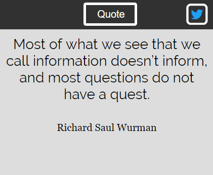

# Quote Machine

A random quote machine. Created while going through the front end frameworks projects at https://beta.freeCodeCamp.com.

<em><b>NOTE:</b> I've recreated this project while learning React. To view my non-React version of this project [go here](https://github.com/Squibs/quote-machine/tree/before-react).</em>

## Front End Libraries

### [Quote Machine](https://squibs.github.io/quote-machine/) (Click to view functional site)

<em>Completed August 22, 2017</em>

The first React project I have created. I wanted to start with something I have already done in the past (a quote machine) and recreate it using React.

I feel this was a pretty good starting point into React for myself. I was struggling pretty hard getting into React, and now since going through many different tutorials and through a bit of a [udemy course](https://www.udemy.com/react-redux/), I feel a bit more confident going forward and creating more React projects.
